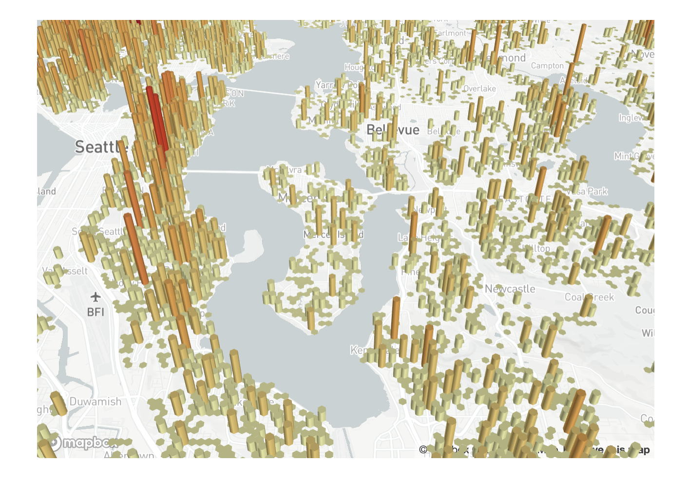
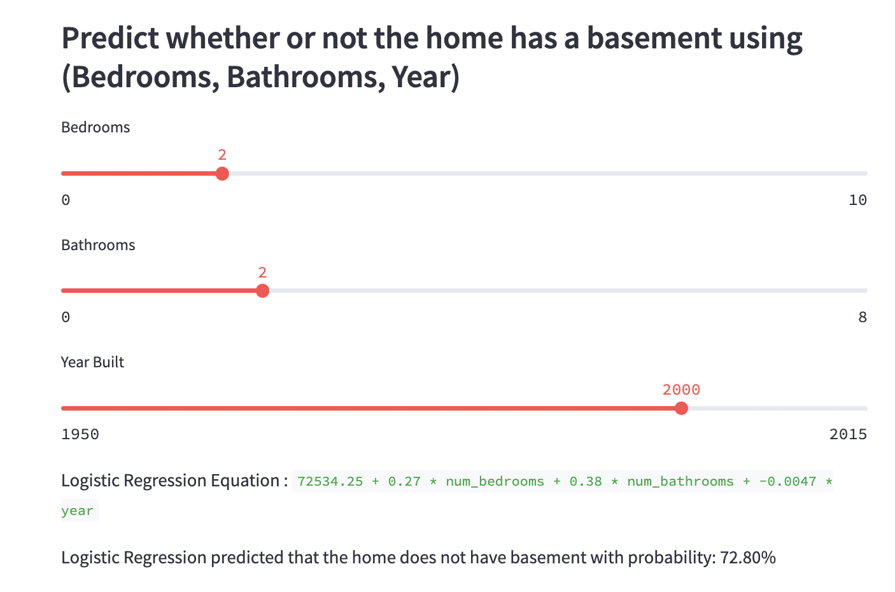
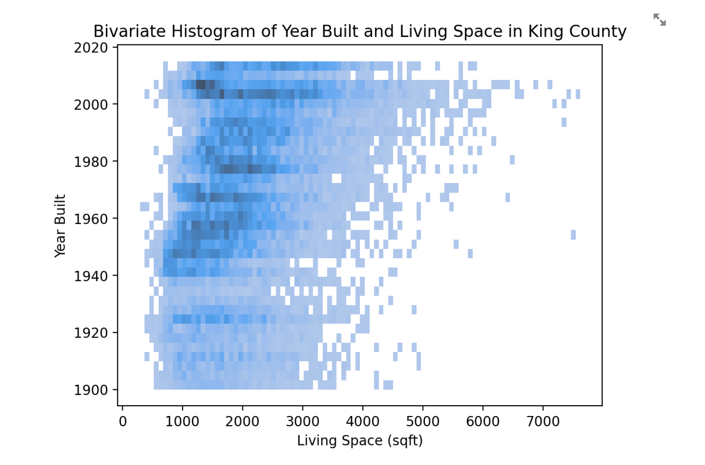
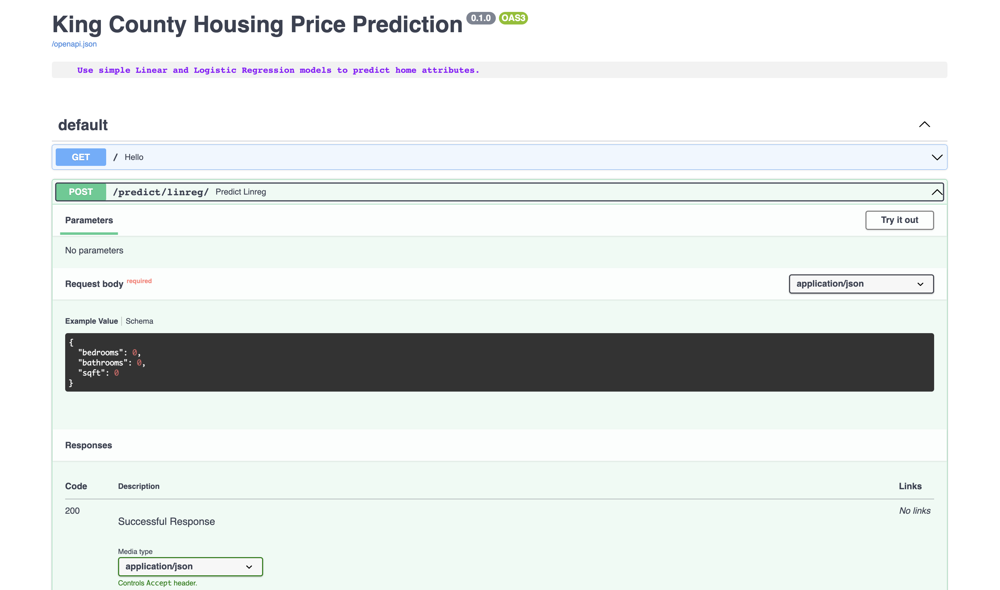

# Data Apps with Streamlit

## Background
- This is an example of an interactive Data Application that performs Exploratory Data Analysis + Charting.
- The application also serves predictions from pre-trained ML models to a user in realtime.







## Data
- The primary [datasource](https://github.com/akan72/mlpowered/blob/main/backend/data/processed/kc_housing_data_processed.csv)
  originally comes from this [Kaggle competition](https://www.kaggle.com/datasets/harlfoxem/housesalesprediction). It contains
  price data from homes sold in King County, WA from May 2014 - May 2015.
- There is also a hand-curated [dataset](https://github.com/akan72/mlpowered/blob/main/backend/data/processed/zipcode_city_mapping.xlsx)
  of Zipcodes that is used to determine the city each house is in.

## Directory Structure

```
├── README.md
├── backend
│   ├── Dockerfile                              - Dockerfile for the `backend` service
│   ├── api.py                                  - FastAPI backend definition
│   ├── data
│   │   ├── processed
│   │   │   ├── kc_housing_data_processed.csv   - Processed, clean data used to power models
│   │   │   └── zipcode_city_mapping.xlsx       - Curated dataset assigning each Zipcode to a city
│   │   └── raw
│   │       └── kc_house_data.csv               - Raw, immutable data from Kaggle
│   ├── images                                  - Pre-saved images and 3D plots
│   │   ├── 3dplot.pickle
│   │   ├── prcurve.png
│   │   └── roccurve.png
│   ├── modeling.py                             - Python script for training regression modelss
│   ├── models                                  - Directory of serialized ML models
│   │   ├── bed_bath_regressor.pkl
│   │   ├── full_regressor.pkl
│   │   └── logreg.pkl
│   ├── request.py                              - Examples of how to query the API with Python
│   └── requirements.txt                        - Python dependencies for the backend service
├── docker-compose.yml                          - Docker Compose definition for both services
└── frontend
    ├── Dockerfile                              - Dockerfile for the `frontend` service
    ├── landing.py                              - Landing page for the Streamlit frontend
    ├── pages                                   - Streamlit sub-pages
    │   ├── maps.py
    │   └── modeling.py
    ├── requirements.txt                        - Python dependencies for the `frontend` service
    └── utils.py                                - Plotting utilities for the frontend
```

## System Architecture
The application [defines](https://github.com/akan72/mlpowered/blob/main/docker-compose.yml) two services, `backend` and `frontend`.
The application can be easily built through [Docker Compose](https://docs.docker.com/compose/) or manually with multiple terminals.

**Backend**:
  - We use [FastAPI](https://fastapi.tiangolo.com/) as our backend to serve prediction results in real time.
  Under the hood, FastAPI uses the [Uvicorn](https://www.uvicorn.org/) webserver.
  - To validate the structure of our API requests, we use [Pydantic](https://fastapi.tiangolo.com/features/#pydantic-features) models.
  - The best performing models are trained using [sklearn](https://scikit-learn.org/), serialized, and then saved to disk.
  - For visualization, we use a mix of vanilla [Matplotlib](https://matplotlib.org/), [Seaborn](https://seaborn.pydata.org/), and [PyDeck](https://deckgl.readthedocs.io/en/latest/) for mapping.

**Frontend**:
  - We use [Streamlit](https://streamlit.io/), a powerful framework that lets us build interactive web applications entirely in Python!
  - Within the frontend, we have multiple pages for performing Exploratory Data Analysis, Mapping, and obtaining the results of our ML Models.

## Setup Instructions

```{bash}
git clone https://github.com/akan72/mlpowered.git
cd mlpowered
```

### With Docker

Install Docker and [Docker Compose](https://docs.docker.com/compose/install/).
After installing, make sure that the Docker Daemon is running by starting the Docker Desktop app.

```{bash}
docker-compose up
```

### Without Docker

Install the required Python dependencies

```
pip install -r backend/requirements.txt -r frontend/requirements.txt
```

Start the Uvicorn webserver + FastAPI backend in one terminal

```{bash}
uvicorn backend.api:app
```

Start the Streamlit frontend in another terminal

```
streamlit run frontend/landing.py
```

## Using the App
Navigate to http://localhost:8501 to view the live app!

Send POST requests to the API to get live predictions!

```{python}
import requests

url = 'http://localhost:8000/predict/linreg/'

json = {
    'bedrooms': 3,
    'bathrooms': 2,
    'yr_built': 2000,
}

predicted_price = requests.post(url, json=json)

print(predicted_price.status_code)
print(predicted_price.json()['price'])
print(predicted_price.json()['model'])
```

Visit http://localhost:8000/docs to view the auto generated Swagger docs created by FastAPI!

From this view, we can also hit the API endpoints directly without wriing any code.

To retrain the models, run:
```{bash}
cd backend
python modeling.py
```

Additional code examples for submitting requests may also be found in `backend/request.py`
